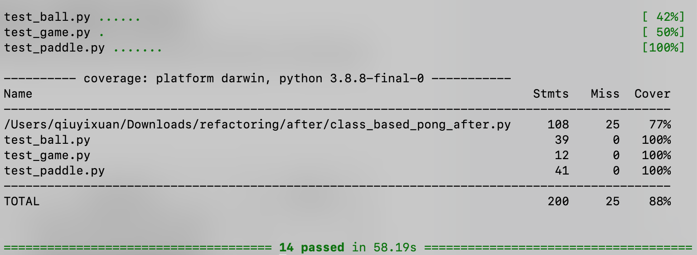

# Project 4: Refactoring

# Extension:
  
#### 1. Apply refactoring to the file “search_maze_before.py”  
  
  
#### 2. Create unit tests for the two games using Pytest and generate a code coverage report.

  

  
The test code for Pong is split into three parts--test_paddle, test_ball, and test_game.  

#### 3. Apply refactoring to Sudoku from CS231.
  
  
