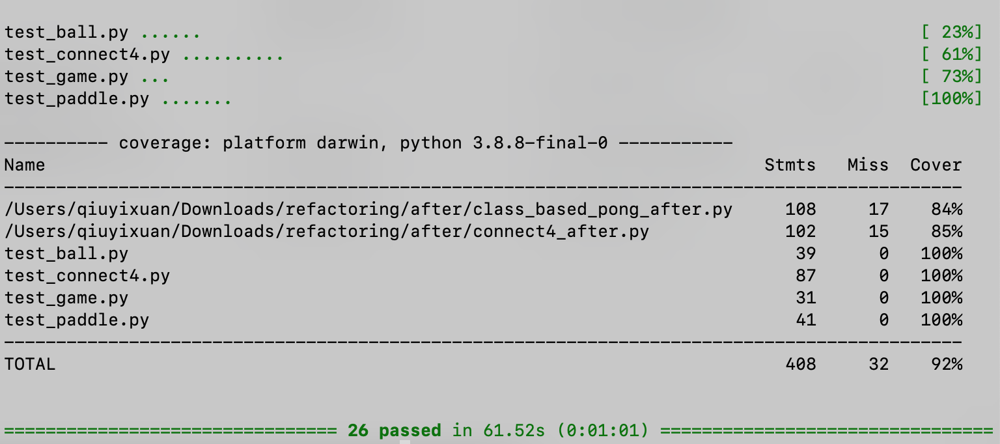

# Project 4: Refactoring

# Extension:
  
#### 1. Apply refactoring to the file “search_maze_before.py”  
 
#### 2. Apply refactoring to Sudoku from CS231.   

#### 3. Create unit tests for the two games using Pytest and generate a code coverage report.

  

The test code for Pong is split into three parts: test_paddle, test_ball, and test_game.  

  
  
